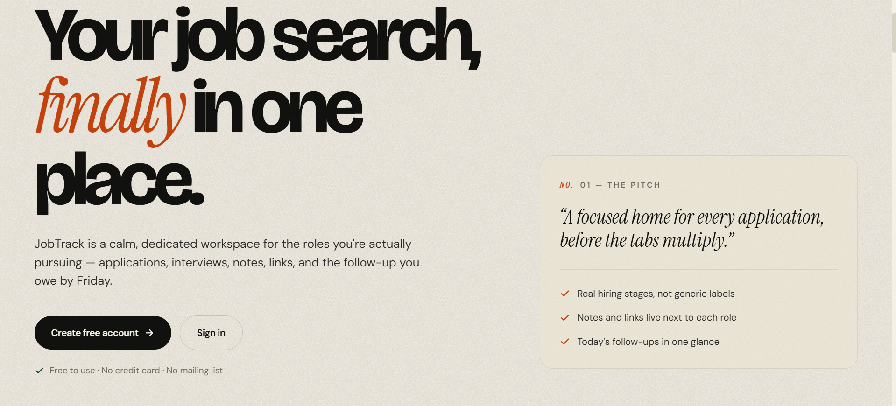
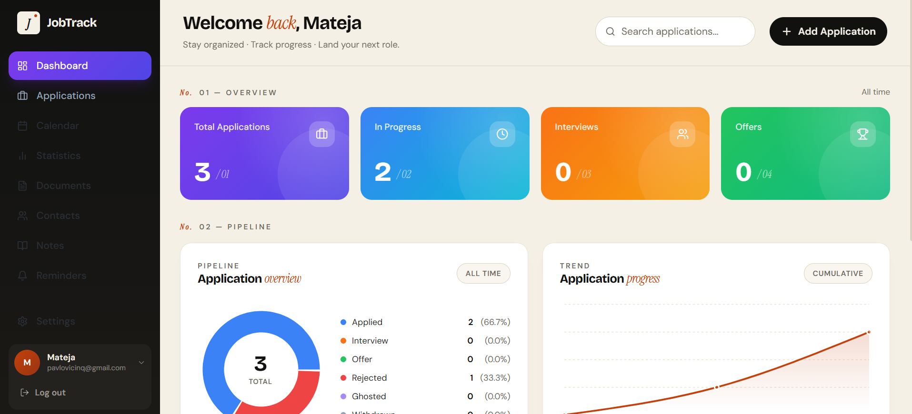

# JobTrack

A full-stack job application tracker — organized pipeline, real hiring stages, and progress charts in one place.

**Live:** [job-track.app](https://job-track.app) · **API docs:** [swagger](https://jobtrack-api-goyf.onrender.com/swagger)

---

## Screenshots





---

## Problem

Job seekers spread applications across browser tabs, spreadsheets, and sticky notes. There is no single place that ties together where you applied, what stage each role is at, and when you need to follow up. JobTrack is that place.

---

## Features

**Application pipeline**

- Create, edit, and delete job applications — company, position, link, notes, applied date
- Six real hiring stages: Applied, Interview, Offer, Rejected, Ghosted, Withdrawn
- Filter by status, sort newest/oldest, and search by company or role
- Deep-link directly to any application via URL parameter

**Dashboard**

- Stat cards: total applications, in-progress, interviews, offers
- Donut chart with per-status counts and percentages
- Cumulative trend chart showing application volume over time

**Authentication**

- Email + password registration and login
- JWT bearer tokens — every application endpoint is protected
- Per-user data isolation enforced in the service layer
- Rate-limited auth routes (sliding and fixed-window limiters)
- BCrypt-hashed passwords

**Quality**

- FluentValidation on all request bodies
- Structured logging via Serilog (console + rolling file, compact JSON)
- MongoDB Atlas health check endpoint
- Integration test suite: auth flow, CRUD, authorization, index behavior
- Playwright E2E tests, Vitest unit tests

---

## Tech stack

### Backend (`Api/`)

| Concern          | Choice                                                                    |
| ---------------- | ------------------------------------------------------------------------- |
| Framework        | ASP.NET Core 10 Web API (C#)                                              |
| Database         | MongoDB Atlas — `MongoDB.Driver` 3.x                                      |
| Authentication   | JWT bearer — `Microsoft.AspNetCore.Authentication.JwtBearer`              |
| Password hashing | `BCrypt.Net-Next`                                                         |
| Validation       | `FluentValidation`                                                        |
| Rate limiting    | Built-in `AspNetCore.RateLimiting` (sliding + fixed windows)              |
| Logging          | Serilog — console + rolling compact-JSON file                             |
| API docs         | Swashbuckle / OpenAPI (`/swagger`)                                        |
| Health checks    | `AspNetCore.HealthChecks.MongoDb`                                         |
| Secrets          | `dotnet user-secrets` in development; environment variables in production |

### Frontend (`frontend/`)

| Concern       | Choice                               |
| ------------- | ------------------------------------ |
| Framework     | React 18 + Vite                      |
| Routing       | React Router v6                      |
| Server state  | TanStack Query v5                    |
| Forms         | React Hook Form + Zod                |
| Styling       | Tailwind CSS                         |
| Charts        | Recharts                             |
| Icons         | Lucide React                         |
| Notifications | React Toastify                       |
| Testing       | Vitest + Testing Library, Playwright |

---

## Architecture

The backend is organized as three single-responsibility layers:

```
┌──────────────┐    ┌──────────────┐    ┌──────────────┐    ┌───────────┐
│  Controller  │ ─► │   Service    │ ─► │  Repository  │ ─► │  MongoDB  │
│  (HTTP only) │    │  (business   │    │  (data       │    │           │
│              │    │   rules)     │    │   access)    │    │           │
└──────────────┘    └──────────────┘    └──────────────┘    └───────────┘
```

Controllers translate HTTP, extract the authenticated user from the JWT, and return status codes — no business logic. Services enforce ownership, timestamps, and validation — no HTTP or database awareness. Repositories are the only layer that talks to MongoDB, exposing typed async methods and returning domain entities.

Each layer is exposed through an interface; dependency injection wires them together and makes any layer independently swappable or mockable.

```
Api/
├── Controllers/        HTTP entry points
├── Services/           Business logic
│   └── Interfaces/
├── Repositories/       MongoDB access
│   └── Interfaces/
├── Dto/                Request / response contracts
├── Models/             Domain entities
├── Shared/             MongoDBContext
└── Program.cs          Composition root
```

---

## API reference

Base URL (development): `http://localhost:5003`

### Authentication

| Method | Route                | Auth | Description                    |
| ------ | -------------------- | ---- | ------------------------------ |
| `POST` | `/api/auth/register` | —    | Create a new user              |
| `POST` | `/api/auth/login`    | —    | Exchange credentials for a JWT |

Both routes are rate-limited. Full schemas available in Swagger at `/swagger`.

### Job applications

All endpoints require `Authorization: Bearer <token>`.

| Method   | Route                      | Description                    |
| -------- | -------------------------- | ------------------------------ |
| `GET`    | `/api/jobapplication`      | List the caller's applications |
| `POST`   | `/api/jobapplication`      | Create a new application       |
| `PUT`    | `/api/jobapplication/{id}` | Update an existing application |
| `DELETE` | `/api/jobapplication/{id}` | Delete an application          |

---

## Getting started

### Prerequisites

- [.NET 10 SDK](https://dotnet.microsoft.com/download)
- [Node.js 20+](https://nodejs.org/)
- A [MongoDB Atlas](https://www.mongodb.com/cloud/atlas) cluster (free tier works)

### 1. Clone

```bash
git clone <repo-url>
cd JobTrack
```

### 2. Configure backend secrets

```bash
dotnet user-secrets set "MongoDB:ConnectionString" "<atlas-connection-string>" --project Api
dotnet user-secrets set "Jwt:SecretKey" "<random-256-bit-hex>" --project Api
```

Non-secret settings (database name, collection names, rate-limit windows) are in `Api/appsettings.json`.

### 3. Run the API

```bash
dotnet run --project Api
```

API: `http://localhost:5003` — Swagger UI: `http://localhost:5003/swagger`

### 4. Run the frontend

```bash
cd frontend
npm install
npm run dev
```

SPA: `http://localhost:5173` (CORS is preconfigured for this origin in `Api/Program.cs`)

### 5. Run tests

```bash
# Backend integration tests
dotnet test Api.Tests

# Frontend unit tests
cd frontend && npm test

# Frontend E2E tests
cd frontend && npm run test:e2e
```

---

## Design decisions

**MongoDB over a relational database** — Job applications are self-contained documents with no cross-user joins. MongoDB's flexible schema made early iterations faster and Atlas's free tier keeps hosting costs at zero. The trade-off is that multi-document transactions and complex aggregations require more care; neither is needed here.

**JWT stateless auth over sessions** — A stateless token fits a decoupled SPA/API deployment: no session store, no sticky routing. The trade-off is that tokens cannot be revoked before expiry without a denylist; acceptable given the short expiry window configured.

**Three-layer backend (Controller → Service → Repository)** — The seam between each layer is an interface, so unit tests can mock any one layer in isolation. The trade-off is more files for a small API; the payoff is that the integration test suite can swap out repositories entirely via `TestWebAppFactory`.

**TanStack Query for server state** — Automatic background refetch, cache invalidation on mutations, and built-in loading/error states eliminate the need for hand-rolled fetch logic. The trade-off is a larger bundle; given that Recharts is already a dependency, the marginal size is acceptable.

---

## License

MIT
