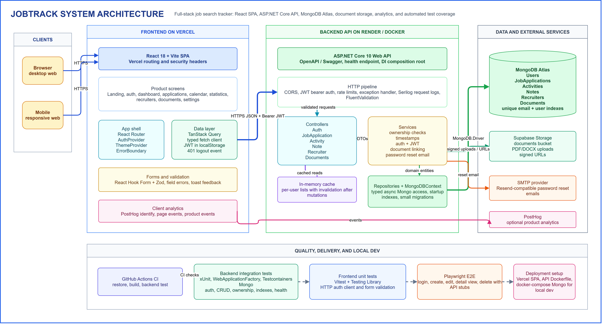
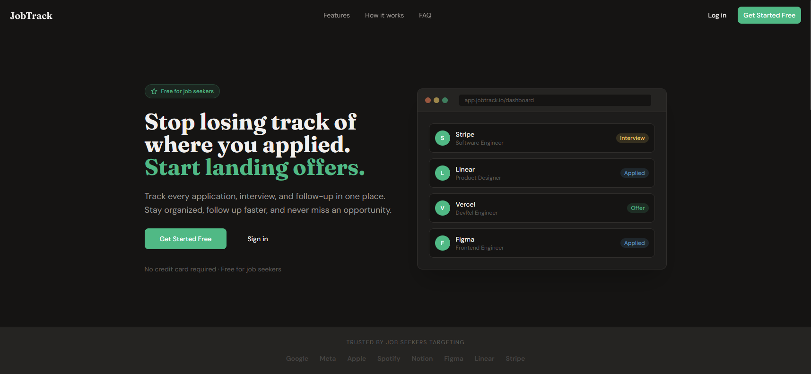
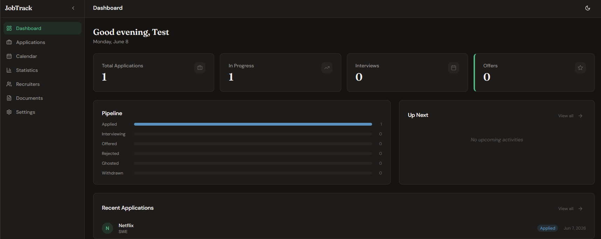

# JobTrack

JobTrack is a full-stack job search tracker I built to replace the messy spreadsheet most job seekers end up with. It keeps applications, recruiter contacts, follow-up activities, notes, and resume documents tied to one account.

**Live:** [job-track.app](https://job-track.app) | **API docs:** [Swagger](https://jobtrack-api-goyf.onrender.com/swagger)

## System architecture



Editable diagram files live in [docs/architecture](docs/architecture/). The `.drawio.png` export can be opened directly in draw.io for tweaks before posting on LinkedIn.

## Screenshots





## What the app does

- Tracks applications by company, position, link, status, location, salary, source, work mode, applied date, recruiter, and resume version.
- Supports six hiring stages: Applied, Interview, Offer, Rejected, Ghosted, and Withdrawn.
- Gives both list and kanban views, with search, filtering, and sorting on the client.
- Adds notes and follow-up activities to each application.
- Stores recruiter contacts so outreach is not lost in browser tabs or email history.
- Uploads resume and cover letter files through the API, stores them in Supabase Storage, and links documents back to applications.
- Shows dashboard and statistics views with pipeline counts, response rate, interview rate, cumulative applications, funnel charts, and activity history.
- Handles email and password auth, password reset emails, JWT-protected API calls, and per-user data isolation.

## What I wanted this project to show

- A real SPA/API split, not a single-page mockup.
- A backend that separates HTTP, business rules, and data access through controllers, services, and repositories.
- Auth and ownership checks that return `404` for another user's resources instead of leaking whether a record exists.
- MongoDB indexes created on startup for email uniqueness and common user-scoped queries.
- File upload flow through the API with signed document URLs.
- Integration tests that boot the API against a real MongoDB container.
- A frontend with typed API helpers, React Query caching, form validation, optimistic UI patterns, and route-level pages.
- Deployment basics: Vercel config, API Dockerfile, local Docker Compose setup, and GitHub Actions for the .NET build and tests.

## Tech stack

### Backend

| Area | Choice |
| --- | --- |
| API | ASP.NET Core 10 Web API |
| Language | C# |
| Database | MongoDB Atlas with `MongoDB.Driver` |
| Auth | JWT bearer tokens, BCrypt password hashing |
| Validation | FluentValidation |
| Storage | Supabase Storage for uploaded documents |
| Email | SMTP through a Resend-compatible provider |
| Logging | Serilog request logging |
| API docs | Swagger / OpenAPI |
| Testing | xUnit, WebApplicationFactory, Testcontainers for MongoDB |

### Frontend

| Area | Choice |
| --- | --- |
| App | React 18 + Vite |
| Routing | React Router |
| Server state | TanStack Query |
| Forms | React Hook Form + Zod |
| Styling | Tailwind CSS and Radix-based UI components |
| Charts | Recharts and `react-activity-calendar` |
| Analytics | PostHog, loaded only when configured |
| Testing | Vitest, Testing Library, Playwright |
| Hosting | Vercel |

## Backend shape

The API follows a simple layered structure:

```text
Controller -> Service -> Repository -> MongoDB
```

Controllers read route data and the authenticated user id. Services enforce ownership, timestamps, linking rules, and DTO mapping. Repositories are the only code that talks to MongoDB.

Main API areas:

| Area | Routes |
| --- | --- |
| Auth | `POST /api/auth/register`, `POST /api/auth/login`, `POST /api/auth/forgot-password`, `POST /api/auth/reset-password` |
| Applications | `GET /api/jobapplication`, `GET /api/jobapplication/{id}`, `POST /api/jobapplication`, `PUT /api/jobapplication/{id}`, `DELETE /api/jobapplication/{id}`, `PATCH /api/jobapplication/{id}/document` |
| Activities | `GET /api/activity`, `GET /api/activity/{id}`, `GET /api/activity/job/{jobId}`, `POST /api/activity/job/{jobId}`, `PUT /api/activity/{id}`, `PATCH /api/activity/{id}/complete`, `DELETE /api/activity/{id}` |
| Notes | `GET/POST /api/jobapplications/{jobId}/notes`, `PUT/DELETE /api/jobapplications/{jobId}/notes/{id}` |
| Recruiters | `GET/POST /api/recruiter`, `GET/PUT/DELETE /api/recruiter/{id}` |
| Documents | `GET /api/documents`, `POST /api/documents`, `DELETE /api/documents/{id}` |
| Health | `GET /health` |

## Local setup

### Requirements

- [.NET 10 SDK](https://dotnet.microsoft.com/download)
- [Node.js 20+](https://nodejs.org/)
- Docker, required for Testcontainers and the local MongoDB option
- A Supabase project with a `documents` bucket
- SMTP credentials for password reset email

### Run with Docker Compose

```bash
cp .env.example .env
# Fill in JWT_SECRET, SUPABASE_URL, SUPABASE_SERVICE_KEY, and SMTP values.
docker compose up --build
```

API: `http://localhost:8080`

Swagger: `http://localhost:8080/swagger`

### Run the API with `dotnet`

```bash
dotnet user-secrets set "MongoDB:ConnectionString" "<mongodb-connection-string>" --project Api
dotnet user-secrets set "MongoDB:DatabaseName" "jobtrack" --project Api
dotnet user-secrets set "JWT:SecretKey" "<long-random-secret>" --project Api
dotnet user-secrets set "SupaBase:Url" "<supabase-url>" --project Api
dotnet user-secrets set "SupaBase:Key" "<supabase-service-role-key>" --project Api
dotnet user-secrets set "Email:SmtpHost" "<smtp-host>" --project Api
dotnet user-secrets set "Email:SmtpPort" "587" --project Api
dotnet user-secrets set "Email:SmtpUser" "<smtp-user>" --project Api
dotnet user-secrets set "Email:SmtpPassword" "<smtp-password>" --project Api
dotnet user-secrets set "Email:FromAddress" "noreply@example.com" --project Api
dotnet user-secrets set "AppBaseUrl" "http://localhost:5173" --project Api
dotnet run --project Api
```

API: `http://localhost:5003`

Swagger: `http://localhost:5003/swagger`

### Run the frontend

```bash
cd frontend
cp .env.example .env.local
npm install
npm run dev
```

Set `VITE_BASE_API` in `frontend/.env.local` to the API you are using:

```bash
VITE_BASE_API=http://localhost:5003
```

Frontend: `http://localhost:5173`

## Tests

```bash
# Backend integration tests. Docker must be running.
dotnet test JobTrack.slnx

# Frontend unit tests
cd frontend
npm run test:run

# Browser flow test
npm run test:e2e
```

Current backend coverage checks registration, login, protected routes, application CRUD, ownership isolation, Mongo index behavior, and health checks.

## Current gaps

The main app works, but there are still sensible next steps:

- Move dashboard and statistics aggregation into backend endpoints once the dataset grows.
- Add server-side search, status filtering, and pagination for application lists.
- Add a refresh-token flow and logout endpoint for token revocation.
- Finish profile editing in the Settings page.
- Add email verification before opening signups more widely.

More detail is in [docs/ROADMAP.md](docs/ROADMAP.md).

## License

MIT
